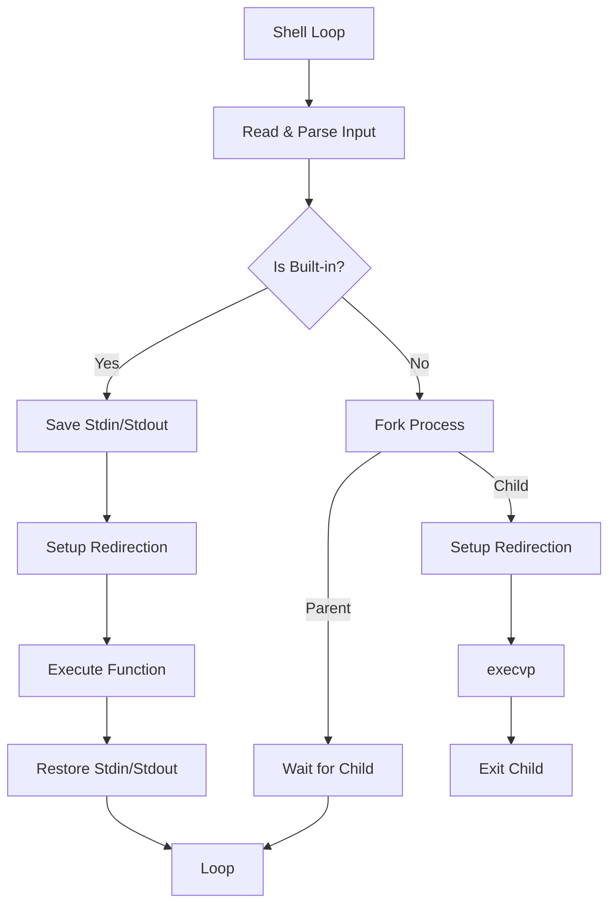

# Custom C Shell Implementation 

## 1. Overview
A custom shell implementation in C featuring process management, I/O redirection, and pipeline orchestration.

**Features:**
- **Built-in Commands:** `help`, `cd`, `pwd`, `echo`, `exit`, `record` (History).
- **External Commands:** Support for standard system executables (via `execvp`).
- **I/O Redirection:** Input (`<`) and Output (`>`).
- **Pipelining:** Multi-stage pipes (`A | B | C`).

---

## 2. Built-in vs. External Commands

The core distinction lies in the execution context:

| Type | Execution Context | Mechanism |
| :--- | :--- | :--- |
| **Built-in** | Current Process | Function call within shell process. Modifies shell state (e.g., `cd`). |
| **External** | New Process | `fork()` $\to$ Child Process $\to$ `execvp()`. |

### Execution Flow Diagram


## 3. Architecture (MVC Pattern)
The project structure separates data, logic, and control flow:
```c
main:
    Load_config_files()
    shell_loop() // Read -> Parse -> Execute
    Shutdown()
```
- `command.h` (The Model): Defines data structures (struct cmd, struct cmd_node) and memory management (create/free).

- `builtin.h` (The Module): Contains specific logic for built-in command functions.

- `shell.h` (The Controller): Manages the lifecycle, input parsing, and process orchestration.

## 4. Key Insights
### Redirection vs Piping 

| Feature          | Redirection                      | Piping                                 |
|------------------|---------------------------------------------|---------------------------------------------|
| **Target**       | File (storage on filesystem)                | Another process (via kernel pipe buffer)    |
| **Data Action**  | May replace file content (`O_TRUNC`) or append (`O_APPEND`) | Feeds `stdout` of one process into `stdin` of the next |
| **Persistence**  | Data written to disk            | Exists only in memory buffers    |
| **`fork()`** |  Inherited       |  Inherited    |
| **`exec*`** | Preserved | Preserved  |

<br>

To Prevent Inheritance: If you have an FD that the child process should not see (e.g., internal shell database connection), you set the Close-on-Exec flag. Code snippet from Gemini 3:

<br>


```c
void execute_with_cloexec() {
    // 1. Open a file (e.g., an internal shell log)
    int fd = open("shell_debug.log", O_WRONLY | O_CREAT, 0644);

    // 2. Set the "Close-On-Exec" flag
    // This marks the FD so the OS automatically closes it when execv runs
    if (fcntl(fd, F_SETFD, FD_CLOEXEC) == -1) {
        perror("fcntl");
    }

    pid_t pid = fork();

    if (pid == 0) {
        // === CHILD PROCESS ===
        // RIGHT NOW: The child DOES have 'fd' open (inherited via fork).
        
        char *args[] = {"ls", "-l", NULL};

        // 3. Replace the process
        execv("/bin/ls", args);
        
        // === INSIDE 'ls' PROGRAM ===
        // The 'ls' program will NOT have 'fd' open.
        // The OS checked the FD_CLOEXEC flag and closed it during the execv transition.
    }
    
    // Parent cleans up its own copy
    close(fd);
}
```

<br>

### Concurrency & The "Wait" Trap in pipelines
A critical logic point in pipelines is **avoiding sequential blocking**. The shell must start all processes in the pipeline before waiting for any of them to prevent deadlocks (where cmd2 waits for input, but cmd1 is blocked from writing). <br> <br>
Sequential/Blocking
```c
while (curr != NULL) {
    fork();
    // ... setup pipes ...
    wait(NULL); // ERROR: Parent stops here!
    curr = curr->next;
}
```

Concurrent/Streaming
```c
while (curr != NULL) {
    fork();
    // ... setup pipes ...
    // Do NOT wait here. Continue to launch next command.
    curr = curr->next;
}

// Harvest all zombies after the pipeline is fully active
while (wait(NULL) > 0);
```

### FD Management Timing
Setup: Must happen **before** execution logic starts. <br>
Restore: Must happen **after** execution (crucial for built-ins to avoid permanently silencing the shell).

## 5. Implementation Notes
- Coding Style: C99 style rather than C89 standard (variables declared at top of scope).

- `execvp` Behavior: If filename contains `/`, it treats it as a path (relative or absolute).

    - Otherwise, it searches `PATH`.

    - Expects argv to be `NULL-terminated`: ["ls", "-l", NULL].

- `strtok` Behavior: avoid double free
## 6. References
[Brennan's implementation of LSH](https://github.com/brenns10/lsh)

[StackOverflow - Wrapper function for malloc](https://stackoverflow.com/questions/262439/create-a-wrapper-function-for-malloc-and-free-in-c)


[Ask Ubuntu - What is the difference between "Redirection" and "Pipe"?](https://askubuntu.com/questions/172982/what-is-the-difference-between-redirection-and-pipe)

[Hacker News - Discussion C89 coding style](https://news.ycombinator.com/item?id=32525817)


[Stackoverflow - What does the FD_CLOEXEC fcntl() flag do?](https://stackoverflow.com/questions/6125068/what-does-the-fd-cloexec-fcntl-flag-do)